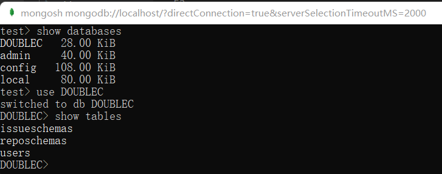

# DoubleC

**Group: Double C++**

Project for Software Requirement Engineering , ZJU

## Technology Stack

Mongodb, Express, React, Node.js

## How to Install

首先利用如下命令创建文件夹并clone本项目。

```shell
mkdir double-c
cd double-c
git clone https://github.com/QizW/software_DoubleC-.git
```

然后如下图出现项目文件，并可进入项目文件夹中：


然后利用vscode打开本项目并进行如下命令来安装相关依赖：

```shell
npm run install-dependencies
```

然后会如下图分别安装后端依赖以及前端依赖：


安装结果如下图所示：


然后进行进行如下命令：

```shell
npm run server
```
会如下图一样显示服务端监听在4538端口：


同时，此时打开mongosh，并查看数据库，可以发现，数据库中多出DOUBLEC，同时切换到DOUBLEC数据库并查看表，能看到数据库中多出如下三张表：




此时另开一个终端进行如下命令(注：如执行命令出现提示：‘mongoimport‘ 不是内部或外部命令，也不是可运行的程序或批处理文件，请看文末)：

```shell
mongoimport -d DOUBLEC -c reposchemas --file ./pytorch/pytorch.json
```

会如下图显示 1 document(s) imported successfully. 


此外，在mongosh中进行下图命令能看到有数据存在：


然后再在终端中进行如下命令：

```shell
mongoimport -d DOUBLEC -c issueschemas --jsonArray --file ./pytorch/issue.json
```

会如下图显示 10736 document(s) imported successfully. 


此外，在mongosh中进行下图命令能看到有数据存在：


此时，运行如下命令：

```shell
# Open another Terminal
npm run client
# the Web App would run on "localhost:3000"
```

等待客户端启动后，在浏览器中会出现如下网页：


注册并登陆后，能看到主界面存在pytorch项目：


## ‘mongoimport‘ 不是内部或外部命令，也不是可运行的程序或批处理文件解决办法

mongoimport不是在mongo shell中运行，而是在cmd中运行。

但是使用时报错：‘mongoimport’ 不是内部或外部命令，也不是可运行的程序或批处理文件，因为没有mongoimport.exe。

需要下载mongo database tool，具体可见<a herf="https://docs.mongodb.com/database-tools/installation/installation-windows/">官方文档</a>，官方文档中有<a herf="https://www.mongodb.com/try/download/shell">下载链接</a>

将下载的.zip文件夹中bin下所有文件复制到 .\mongodb\bin 文件夹下即可。


